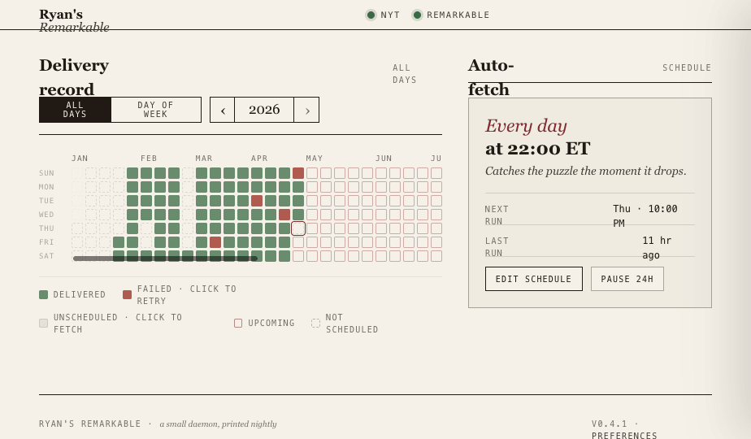

# nyt-crossword-remarkable

A small daemon that fetches the daily NYT crossword puzzle as a PDF and delivers it to your reMarkable tablet — automatically, every night.

Run it on a home server (Mac Mini, Raspberry Pi, any always-on machine), configure it once through the web dashboard, and forget about it. The next day's puzzle will be waiting on your tablet every morning.



## Features

- **Automatic daily delivery** — fetches the crossword PDF the moment it drops (10 PM ET) and uploads it to your reMarkable
- **Web dashboard** — editorial newspaper-styled UI to monitor deliveries, adjust schedule, and fetch past puzzles
- **Activity grid** — GitHub-style calendar showing your delivery history at a glance
- **Click to fetch** — click any day in the grid to fetch and deliver that puzzle on demand
- **Configurable schedule** — pick which days, what time, and what timezone
- **Health monitoring** — live status of your NYT session and reMarkable connection
- **First-run wizard** — guided setup for NYT login and reMarkable pairing
- **Auto-installs rmapi** — no need to install Go or download binaries manually

## Requirements

- **Python 3.10+**
- **A paid NYT Games subscription** (the crossword is behind a paywall)
- **A reMarkable tablet** with cloud sync enabled
- **An always-on machine** to run the daemon (Mac, Linux, Raspberry Pi, etc.)

## Quick Start

### 1. Install

```bash
pip install nyt-crossword-remarkable
```

Or from source:

```bash
git clone https://github.com/YOUR_USERNAME/nyt-crossword-remarkable.git
cd nyt-crossword-remarkable
python3 -m venv .venv
source .venv/bin/activate
pip install -e ".[server]"
```

### 2. Install rmapi (reMarkable cloud CLI)

The tool can auto-download this for you:

```bash
nyt-crossword-remarkable install-rmapi
```

### 3. Register your reMarkable

```bash
~/.config/nyt-crossword-remarkable/bin/rmapi
```

This opens the rmapi shell. It will prompt you for a one-time code:

1. Go to [my.remarkable.com/connect/desktop](https://my.remarkable.com/connect/desktop)
2. Log in and copy the 8-character code
3. Paste it into the terminal

Type `quit` to exit the shell. Your device token is now saved.

### 4. Set your NYT cookie

Log into [nytimes.com](https://www.nytimes.com) in your browser, then:

1. Open DevTools (Cmd+Option+I / F12)
2. Go to **Application** > **Cookies** > `https://www.nytimes.com`
3. Find the cookie named **`NYT-S`** and copy its value

```bash
nyt-crossword-remarkable set-cookie "YOUR_NYT_S_VALUE"
```

The cookie lasts 6-12 months. The dashboard will alert you when it expires.

### 5. Start the server

```bash
nyt-crossword-remarkable serve
```

Open **http://localhost:8742** in your browser. The first-run wizard will guide you through any remaining setup.

### 6. Fetch your first crossword

Click any day in the activity grid, or from the command line:

```bash
nyt-crossword-remarkable fetch
```

Check your reMarkable — the puzzle should appear in the `/Crosswords` folder.

## Configuration

All settings are managed through the web dashboard at **http://your-server:8742/preferences**, or directly in `~/.config/nyt-crossword-remarkable/config.json`.

### Server options

```bash
nyt-crossword-remarkable serve --host 0.0.0.0 --port 8742
```

| Flag | Default | Description |
|------|---------|-------------|
| `--host` | `0.0.0.0` | Bind address. Use `127.0.0.1` to restrict to localhost only. |
| `--port` | `8742` | Port number. |

By default the server listens on all interfaces, so it's accessible from other devices on your network. If you use a VPN like Tailscale or Wireguard, you can access it from anywhere.

### Schedule

Configure which days and what time to fetch, via the dashboard or config file:

```json
{
  "schedule": {
    "enabled": true,
    "days": ["mon", "tue", "wed", "thu", "fri", "sat", "sun"],
    "time": "22:00",
    "timezone": "America/New_York"
  }
}
```

The NYT daily crossword typically drops at **10:00 PM Eastern** the night before.

### Filename pattern

Customize how the PDF is named on your reMarkable. Available tokens:

| Token | Example |
|-------|---------|
| `{date}` | 2026-04-23 |
| `{weekday}` | Wednesday |
| `{mon}` | Apr |
| `{dd}` | 23 |
| `{yyyy}` | 2026 |
| `{mm}` | 04 |
| `{Mon DD, YYYY}` | Apr 23, 2026 |

Tokens can be combined freely: `NYT {weekday} {mon} {dd}` becomes `NYT Wednesday Apr 23`.

## CLI Reference

```bash
# Start the web server + scheduler
nyt-crossword-remarkable serve [--host HOST] [--port PORT]

# Fetch a specific day's puzzle (or today by default)
nyt-crossword-remarkable fetch [--date YYYY-MM-DD]

# Check connection status
nyt-crossword-remarkable status

# Save your NYT session cookie
nyt-crossword-remarkable set-cookie "VALUE"

# View recent fetch history
nyt-crossword-remarkable history [--limit N]

# Download the rmapi binary
nyt-crossword-remarkable install-rmapi
```

## Running as a background service

### macOS (launchd)

Create `~/Library/LaunchAgents/com.nyt-crossword-remarkable.plist`:

```xml
<?xml version="1.0" encoding="UTF-8"?>
<!DOCTYPE plist PUBLIC "-//Apple//DTD PLIST 1.0//EN"
  "http://www.apple.com/DTDs/PropertyList-1.0.dtd">
<plist version="1.0">
<dict>
    <key>Label</key>
    <string>com.nyt-crossword-remarkable</string>
    <key>ProgramArguments</key>
    <array>
        <string>/path/to/your/.venv/bin/nyt-crossword-remarkable</string>
        <string>serve</string>
    </array>
    <key>RunAtLoad</key>
    <true/>
    <key>KeepAlive</key>
    <true/>
    <key>StandardOutPath</key>
    <string>/tmp/nyt-crossword-remarkable.log</string>
    <key>StandardErrorPath</key>
    <string>/tmp/nyt-crossword-remarkable.err</string>
</dict>
</plist>
```

Then load it:

```bash
launchctl load ~/Library/LaunchAgents/com.nyt-crossword-remarkable.plist
```

### Linux (systemd)

Create `~/.config/systemd/user/nyt-crossword-remarkable.service`:

```ini
[Unit]
Description=NYT Crossword to reMarkable

[Service]
ExecStart=/path/to/your/.venv/bin/nyt-crossword-remarkable serve
Restart=always

[Install]
WantedBy=default.target
```

Then:

```bash
systemctl --user enable --now nyt-crossword-remarkable
```

## How it works

1. **Fetches the PDF** from NYT's undocumented print endpoint using your session cookie
2. **Caches it locally** at `~/.config/nyt-crossword-remarkable/cache/`
3. **Uploads to your reMarkable** via [rmapi](https://github.com/ddvk/rmapi) (reMarkable cloud CLI)
4. **Logs the result** to fetch history, visible in the dashboard

The NYT crossword API and reMarkable cloud API are both undocumented/unofficial. This tool is for personal use with your own subscriptions.

## Important notes

- **NYT subscription required.** You must have an active NYT Games or All Access subscription. This tool does not bypass the paywall.
- **Undocumented APIs.** Both the NYT crossword endpoint and the reMarkable cloud API are unofficial. They may change without notice.
- **Cookie expiration.** The NYT session cookie (`NYT-S`) lasts approximately 6-12 months. The dashboard will show a warning when it expires. Re-authenticate by pasting a new cookie.
- **No authentication on the web UI.** The dashboard has no login — it's designed for trusted networks (home LAN, VPN). If you expose it to the internet, add a reverse proxy with authentication.

## Development

```bash
git clone https://github.com/YOUR_USERNAME/nyt-crossword-remarkable.git
cd nyt-crossword-remarkable
python3 -m venv .venv
source .venv/bin/activate
pip install -e ".[dev,server]"

# Run tests
pytest -v

# Run the backend
nyt-crossword-remarkable serve

# Run the frontend dev server (hot reload)
cd frontend
npm install
npm run dev   # serves at localhost:5173, proxies API to localhost:8742
```

### Project structure

```
src/nyt_crossword_remarkable/
  cli.py              # CLI commands (typer)
  config.py           # Config management (pydantic)
  server.py           # FastAPI app + scheduler
  api/                # REST API route modules
  services/           # Core logic (fetcher, uploader, orchestrator, scheduler)
  frontend/dist/      # Built React app (served by FastAPI)

frontend/             # React + TypeScript + Vite source
  src/
    dashboard/        # Activity grid, toolbar, progress strip
    settings/         # Settings drawer
    wizard/           # First-run wizard
    components/       # Shared components (masthead, status pill, etc.)

tests/                # pytest test suite
```

## License

MIT
